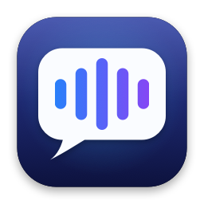
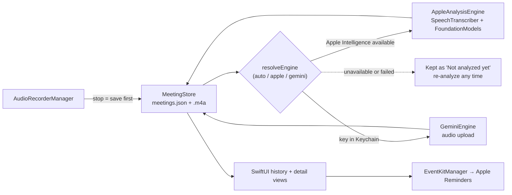

<div align="center">



# EchoScribe

**Record meetings on your Mac. Get transcripts, summaries, action items, and follow-up email drafts — on-device when possible.**

[](https://github.com/tsvb/EchoScribe/releases/latest)
[](LICENSE)


[](https://github.com/tsvb/EchoScribe/releases/latest)

[Install](#install) · [Analysis engines](#analysis-engines) · [How it works](#how-it-works) · [Build from source](#build-from-source) · [Contributing](#contributing)

</div>

---

EchoScribe is a native SwiftUI meeting assistant. Hit record, stop when you're done, and it produces a transcript, an executive summary, an action-item checklist (pushable straight into Apple Reminders), and a follow-up email draft. Every meeting is kept in a persistent, replayable history.

Two design decisions drive everything else:

- **Recording is sacred.** Audio is saved to disk the moment you stop — *before* any analysis runs. A failed, skipped, or keyless analysis never loses a recording; you can re-analyze any past meeting later with whichever engine you like.
- **Analysis is pluggable.** A small `AnalysisEngine` protocol backs two interchangeable engines, so the app works fully offline on new Macs and still works (via Gemini) on older ones.

**Features at a glance**

- One-click recording with live audio-level metering — no account, no API key, no setup
- Every meeting gets a transcript, executive summary, action items, and a follow-up email draft — plus a meeting-mood tag
- Persistent local history — reopen, play back, rename, re-analyze, or delete any meeting
- Action items push to Apple Reminders in one click
- Developer ID signed, Hardened Runtime, notarized and stapled — clean first launch, even offline

## Install

**[Download the DMG from the latest release](https://github.com/tsvb/EchoScribe/releases/latest)**, open it, and drag **EchoScribe** into **Applications**. Both the app and the DMG are signed, notarized, and stapled — Gatekeeper-clean even on a first launch with no network.

| | Requirement |
|---|---|
| Run the app & record | macOS 14 (Sonoma) or later |
| On-device analysis | macOS 26+ with **Apple Intelligence** enabled |
| Gemini analysis *(optional)* | A [Google AI Studio](https://aistudio.google.com/apikey) API key |

On first launch, macOS will ask for **Microphone** access (to record), and for **Reminders** access if you export action items.

## Analysis engines

Pick in **Settings → Analysis Engine** (default: **Auto**).

| | Apple on-device | Gemini |
|---|---|---|
| **Transcription** | `SpeechTranscriber` | Audio uploaded to the Gemini API |
| **Summarization** | FoundationModels, chunked map-reduce for long transcripts | `gemini-3.5-flash` by default (model selectable in Settings) |
| **Speaker names** | No — transcript turns are unattributed | Yes — per-speaker dialogue attribution |
| **Privacy** | Audio never leaves the Mac | Audio and transcript go to Google |
| **Cost / setup** | Free, no API key | Free [AI Studio](https://aistudio.google.com/apikey) API key |
| **Requires** | macOS 26 with Apple Intelligence enabled | Any supported macOS + network |

**Auto** picks Apple when available, else Gemini when a key is configured, else shows an actionable error explaining exactly what to enable.

> [!NOTE]
> **Recording never requires an API key.** Engines only matter at analysis time — record now, analyze later. You can even re-analyze an on-device meeting with Gemini afterwards to get speaker names.

> [!IMPORTANT]
> Current AI Studio keys start with **`AQ.`** — legacy `AIza` keys stop working in September 2026. The key is stored in the macOS Keychain, not in preferences.

## Privacy and your data

- Meeting history lives locally in `~/Library/Application Support/EchoScribe/` — a `meetings.json` index plus one `.m4a` per meeting. Delete a meeting in-app and its audio is deleted with it.
- With the Apple engine, nothing is sent anywhere. With Gemini, audio is uploaded to Google under your own API key.

## How it works



- **`MeetingStore`** is the single source of truth. All mutations write the JSON index atomically and roll back on failure; audio files are deleted in exactly one place (`delete(id:)`). The UI always renders the *stored* analysis for the selected meeting, never a client's in-memory result.
- **`AnalysisEngine`** is a small protocol with two implementations. Engine selection is a pure, unit-tested function (`resolveEngine(preference:context:)`).
- **On-device long transcripts** are summarized with chunked map-reduce sized to the model's context window (`TranscriptChunker`); a context-window overflow retries once at a smaller chunk budget (`RetryPolicy`).
- **`KeychainStore`** holds the Gemini API key in the Keychain.
- **No external dependencies.** Plain `ObservableObject` managers, no package manager, nothing to vendor. High-frequency UI updates (audio metering, playback ticks) are scoped to small observer subviews so the main view tree stays quiet.

The deep technical doc — permissions/TCC details, release process, per-file source map — is [`macos-native/README.md`](macos-native/README.md).

## Build from source

The Xcode project is **generated** from [`macos-native/project.yml`](macos-native/project.yml) with [XcodeGen](https://github.com/yonaskolb/XcodeGen); the `.xcodeproj` is intentionally git-ignored so the build definition never drifts out of code review.

```bash
git clone https://github.com/tsvb/EchoScribe.git
cd EchoScribe/macos-native

brew install xcodegen        # one-time
xcodegen generate            # creates EchoScribe.xcodeproj from project.yml
open EchoScribe.xcodeproj    # then press Cmd-R in Xcode
```

Deployment target is macOS 14; the on-device analysis path uses macOS 26+ APIs behind `@available` guards, so the same binary runs everywhere. For the command-line test and compile checks — and when to regenerate the project — see [`macos-native/README.md` → Build & Run](macos-native/README.md#build--run).

## Repository map

```
.
├── macos-native/            # Primary app (SwiftUI, XcodeGen)
│   ├── project.yml          #   Build definition — the .xcodeproj is generated and git-ignored
│   ├── *.swift              #   App sources (flat module, no external dependencies)
│   ├── Tests/               #   XCTest unit tests
│   ├── Packaging/           #   Hardened Runtime entitlements + icon generator
│   └── scripts/release.sh   #   Signed, notarized, stapled .app + .dmg
├── public/ + server.js      # Legacy web prototype (browser records, calls Gemini directly)
├── docs/superpowers/        # Dated design specs and implementation records (historical)
└── LICENSE                  # MIT
```

## Legacy web prototype

Before the native app there was a single-page prototype: vanilla HTML/CSS/JS served by a tiny Express server. Audio is captured in the browser and sent directly from your browser to the Gemini API with your key (stored only in localStorage — no third-party server involved, but not on-device either).

```bash
npm install
npm start        # serves http://localhost:3000
```

It still works and tracks current Gemini models, but it's maintained at lower priority. For on-device analysis and persistent history, use the macOS app.

## Contributing

Issues and PRs are welcome. Found a security issue? Please report it privately — see [SECURITY.md](SECURITY.md). A few repo-specific conventions:

- The Xcode project is generated and git-ignored — see [`macos-native/README.md`](macos-native/README.md#build--run) for the generated-project workflow, the verification gates to run before claiming a change works, and the test-target rules.
- Keep the zero-dependency style: plain `ObservableObject` managers, existing patterns over new abstractions.
- `docs/superpowers/` contains dated design records — treat them as history, not living documentation.

Releases are cut with [`macos-native/scripts/release.sh`](macos-native/scripts/release.sh), which builds, signs (Developer ID + Hardened Runtime), notarizes, and staples both the app and the DMG.

## License

[MIT](LICENSE) © 2026 Tim VanBenschoten
